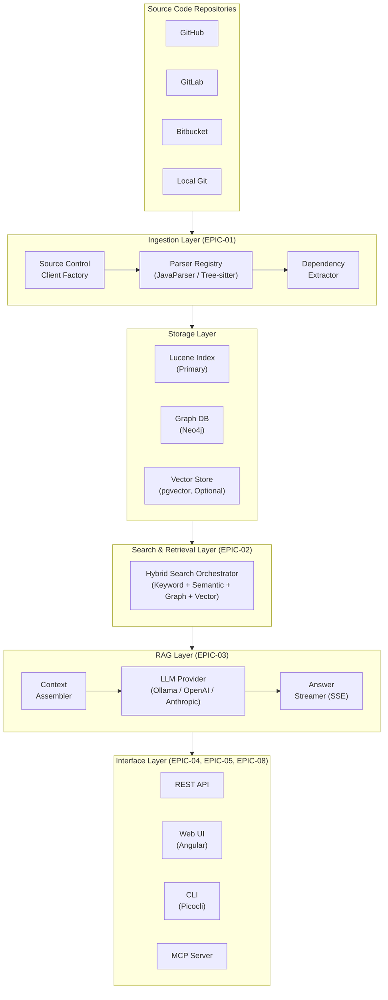
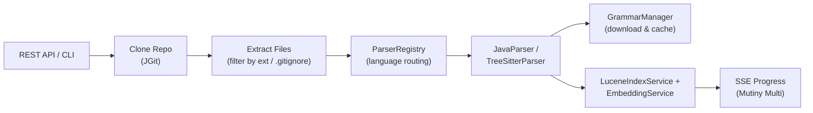
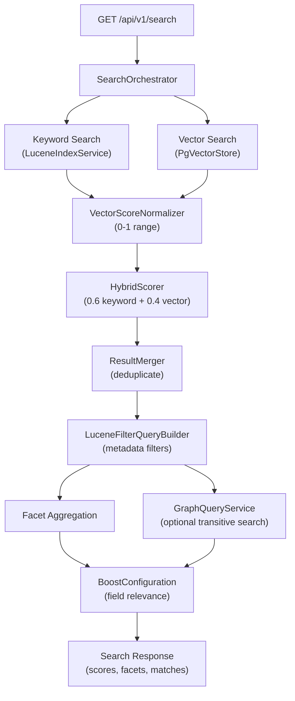

# Architecture

MegaBrain follows a **modular, event-driven architecture** built on a modern Java stack with reactive programming principles.

---

## High-Level Architecture



---

## Backend Package Structure

```
io.megabrain/
├── api/                          # REST endpoints (JAX-RS)
│   ├── SearchResource            # GET /api/v1/search
│   ├── IngestionResource         # POST /api/v1/ingestion
│   ├── HealthResource            # GET /q/health
│   ├── GrammarHealthCheck        # Readiness probe for grammars
│   ├── SearchRequest             # Search request DTO
│   ├── SearchResponse            # Search response with facets
│   ├── SearchResult              # Individual search result DTO
│   ├── IngestionRequest          # Ingestion request DTO
│   ├── IngestionResult           # Ingestion result DTO
│   ├── LineRange                 # Line range metadata
│   └── FieldMatchInfo            # Per-field match scores
│
├── core/                         # Core services and utilities
│   ├── LuceneIndexService        # Lucene index management and search
│   ├── HybridIndexService        # Combines Lucene + vector search
│   ├── SearchOrchestrator        # Coordinates hybrid + graph search
│   ├── ResultMerger              # Merges and deduplicates results
│   ├── QueryParserService        # Lucene query parsing
│   ├── CodeAwareAnalyzer         # camelCase/snake_case tokenizer
│   ├── DocumentMapper            # TextChunk to Lucene Document
│   ├── LuceneSchema              # Index field definitions
│   ├── LuceneFilterQueryBuilder  # Metadata filter construction
│   ├── BoostConfiguration        # Configurable field boosts
│   ├── HybridScorer              # Weighted score combination
│   ├── VectorScoreNormalizer     # Score normalization (0-1)
│   ├── ABTestHarness             # Relevance comparison framework
│   ├── VectorStore               # Vector storage interface
│   ├── PgVectorStore             # pgvector implementation
│   ├── EmbeddingService          # Embedding generation
│   ├── EmbeddingModelService     # Model management
│   ├── GraphQueryService         # Graph query interface
│   ├── GraphQueryServiceStub     # Graph query implementation
│   ├── ImplementsClosureQuery    # Transitive implements traversal
│   ├── ExtendsClosureQuery       # Transitive extends traversal
│   ├── LLMClient                 # LLM provider interface
│   ├── OllamaLLMClient           # Ollama LLM implementation
│   └── OllamaConfiguration       # Ollama config mapping
│
├── ingestion/                    # Code ingestion services
│   ├── IngestionService          # Ingestion orchestration interface
│   ├── IngestionServiceImpl      # Ingestion implementation
│   ├── IncrementalIndexingService # Git-diff based indexing
│   ├── RepositoryIndexStateService # Index state tracking
│   ├── GitDiffService            # Git diff interface
│   ├── JGitDiffService           # JGit diff implementation
│   ├── github/                   # GitHub integration
│   │   ├── GitHubSourceControlClient
│   │   ├── GitHubApiClient
│   │   └── GitHubTokenProvider
│   ├── gitlab/                   # GitLab integration
│   │   ├── GitLabSourceControlClient
│   │   ├── GitLabApiClient
│   │   └── GitLabTokenProvider
│   ├── bitbucket/                # Bitbucket integration
│   │   ├── BitbucketSourceControlClient  # Cloud & Server
│   │   └── BitbucketTokenProvider
│   ├── CompositeSourceControlClient  # Multi-provider routing
│   └── parser/                   # Code parsers
│       ├── CodeParser            # Parser interface
│       ├── ParserRegistry        # Extension-to-parser mapping
│       ├── ParserFactory         # Parser creation
│       ├── GrammarManager        # Grammar lifecycle management
│       ├── GrammarConfig         # Grammar configuration
│       ├── GrammarSpec           # Grammar specification
│       ├── java/                 # Java parsing
│       │   ├── JavaParserService
│       │   └── JavaAstVisitor
│       └── treesitter/           # Tree-sitter parsing
│           └── [14 language parsers: C, C++, Python, JS, TS,
│                Go, Rust, Kotlin, Ruby, Scala, Swift, PHP, C#, Java]
│
└── repository/                   # Repository state persistence
    ├── RepositoryIndexStateRepository
    └── FileBasedRepositoryIndexStateRepository
```

### Frontend (Angular 20)

```
frontend/src/app/
├── app.ts                # Root component
├── app.routes.ts         # Routing configuration
├── app.config.ts         # Application configuration
└── app.spec.ts           # Root component tests
```

The frontend is currently scaffolded with Angular 20 standalone components. Feature modules (dashboard, search, chat) are planned for future sprints.

---

## Data Flow

### Ingestion Flow



1. **Trigger** - Repository ingestion triggered via REST API or CLI
2. **Source Control** - `GitHubSourceControlClient` (or GitLab/Bitbucket) clones repository via JGit
3. **File Extraction** - Files extracted from clone, filtered by extension and `.gitignore`
4. **Language Routing** - `ParserRegistry` maps file extensions to the appropriate parser
5. **Parsing** - `JavaParserService` (for `.java`) or `TreeSitterParser` (for 13+ other languages) creates structured `TextChunk` objects with metadata
6. **Grammar Management** - `GrammarManager` downloads and caches Tree-sitter grammars from GitHub releases
7. **Indexing** - `LuceneIndexService` indexes chunks in Lucene; `EmbeddingService` generates vectors stored in `PgVectorStore`
8. **Progress** - Events emitted via Mutiny `Multi` at each stage for real-time SSE streaming

### Query Flow



1. **Request** - User submits query via REST API (`GET /api/v1/search`)
2. **Orchestration** - `SearchOrchestrator` coordinates the search pipeline
3. **Hybrid Search** - `HybridIndexService` runs:
   - **Keyword search** via `LuceneIndexService` with `CodeAwareAnalyzer`
   - **Vector search** via `PgVectorStore` with cosine similarity (if enabled)
4. **Score Normalization** - `VectorScoreNormalizer` normalizes both score sets to 0-1 range
5. **Score Combination** - `HybridScorer` combines scores with configurable weights (default: 0.6 keyword, 0.4 vector)
6. **Result Merging** - `ResultMerger` deduplicates results appearing in both search modes
7. **Metadata Filtering** - `LuceneFilterQueryBuilder` applies language, repository, entity_type, and file_path filters
8. **Facet Aggregation** - `SortedSetDocValuesFacetCounts` computes available filter values
9. **Transitive Search** (optional) - `GraphQueryService` executes Neo4j graph traversals for `implements:`, `extends:`, and `usages:` queries
10. **Field Boost** - `BoostConfiguration` applies relevance boosts (entity_name=3.0x, doc_summary=2.0x)
11. **Response** - Results returned with scores, facets, field matches, and transitive markers
