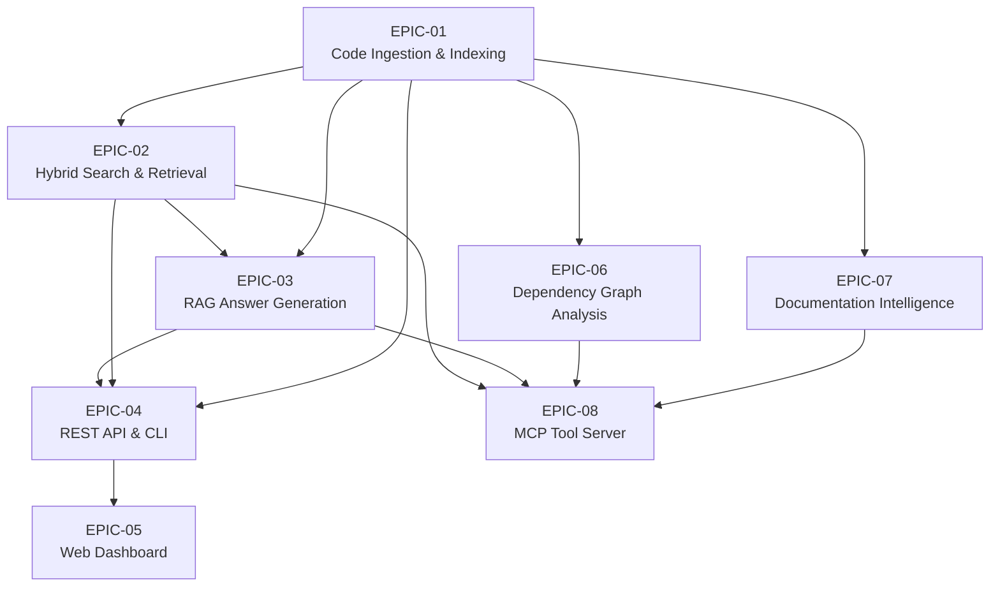

# MegaBrain Epics Index

This directory contains the agile epics for the MegaBrain RAG Pipeline project. Each epic represents a major functional area derived from the [Feature Specification](../feature_specification.md).

## Epic Overview

| Epic ID | Name | Priority | Scope | Status |
|:--------|:-----|:---------|:------|:-------|
| [EPIC-01](EPIC-01-ingestion.md) | Code Ingestion & Indexing | Critical | XL | Planned |
| [EPIC-02](EPIC-02-search.md) | Hybrid Search & Retrieval | Critical | L | Planned |
| [EPIC-03](EPIC-03-rag.md) | RAG Answer Generation | Critical | M | Planned |
| [EPIC-04](EPIC-04-api-cli.md) | REST API & CLI | High | M | Planned |
| [EPIC-05](EPIC-05-web-dashboard.md) | Web Dashboard | High | L | Planned |
| [EPIC-06](EPIC-06-dependency-graph.md) | Dependency Graph Analysis | High | L | Planned |
| [EPIC-07](EPIC-07-documentation.md) | Documentation Intelligence | Medium | M | Planned |
| [EPIC-08](EPIC-08-mcp-server.md) | MCP Tool Server | High | L | Planned |

## Dependency Graph

## Recommended Implementation Order

### Phase 1: Foundation (Critical Path)
1. **EPIC-01: Code Ingestion & Indexing** - Foundation for all other epics
2. **EPIC-02: Hybrid Search & Retrieval** - Core search capability

### Phase 2: Core Features
3. **EPIC-03: RAG Answer Generation** - LLM-powered Q&A
4. **EPIC-04: REST API & CLI** - System interfaces

### Phase 3: Enhanced Capabilities
5. **EPIC-06: Dependency Graph Analysis** - Code intelligence (can run parallel with Phase 2)
6. **EPIC-07: Documentation Intelligence** - Doc extraction (can run parallel with Phase 2)

### Phase 4: User Interfaces
7. **EPIC-05: Web Dashboard** - Frontend application
8. **EPIC-08: MCP Tool Server** - LLM tool integration

## Specification Mapping

| Epic | Spec Section | Functional Requirements |
|:-----|:-------------|:------------------------|
| EPIC-01 | 4.1 | FR-ING-01 through FR-ING-05 |
| EPIC-02 | 4.2 | FR-SRH-01 through FR-SRH-03 |
| EPIC-03 | 4.3 | FR-RAG-01 through FR-RAG-03 |
| EPIC-04 | 4.4 | FR-IFC-01, FR-IFC-02 |
| EPIC-05 | 4.4 | FR-IFC-03 |
| EPIC-06 | 4.5 | FR-DEP-01 through FR-DEP-04 |
| EPIC-07 | 4.6 | FR-DOC-01 through FR-DOC-04 |
| EPIC-08 | 4.7 | FR-MCP-01 through FR-MCP-06, FR-IFC-04 |

## Key Implementation Components by Epic

| Epic | Primary Components |
|:-----|:-------------------|
| EPIC-01 | `RepositoryIngestionService`, `SourceControlClientFactory`, `TreeSitterParser`, `JavaParserService`, `ParserRegistry`, `GrammarManager` |
| EPIC-02 | `LuceneIndexService`, `VectorStore`, `MegaBrainOrchestrator` |
| EPIC-03 | `RagService`, `MegaBrainOrchestrator` |
| EPIC-04 | `IngestionResource`, `SearchResource` |
| EPIC-05 | Angular Dashboard (Ingestion, Search, Chat modules) |
| EPIC-06 | `DependencyExtractor`, `GraphQueryService` |
| EPIC-07 | `DocCommentParser`, `DocumentationQualityAnalyzer` |
| EPIC-08 | `MCPServer`, `MCPToolRegistry`, `MCPResourceProvider` |

---

**Last Updated:** December 2024  
**Source Document:** [Feature Specification](../feature_specification.md)

