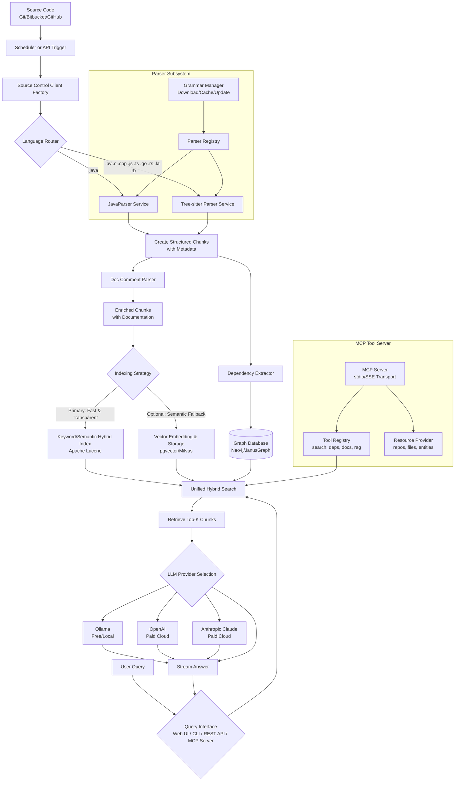

# MegaBrain RAG Pipeline: Feature Specification

## 1.0 Executive Summary

**Project Name:** MegaBrain RAG Pipeline  
**Version:** 1.0  
**Specification Date:** December 2025

**Vision:** To build a scalable, self-hosted, and intelligent code knowledge platform. MegaBrain indexes multi-language source code from various repositories and provides precise semantic search and natural language Q&A through a modern, reactive architecture—all without mandatory external AI services for its core retrieval.

**Core Value Proposition:** Solves the problem of knowledge fragmentation across large, polyglot, and actively evolving codebases. It moves beyond simple text search by understanding code semantics and structure, providing developers with instant, context-aware answers about their own code.

## 2.0 Problem Statement & Goals

### 2.1 The Problem
*   **Lost Context:** Developers struggle to find specific implementations, API usage patterns, and documentation scattered across repositories (Java, C++, Python, JS/TS, etc.).
*   **Inefficient Search:** Traditional `grep` or IDE search lacks semantic understanding and cannot answer "how-to" questions.
*   **External Dependency Risk:** Using general-purpose LLMs or external code assistants risks exposing proprietary code and lacks specific project context.
*   **Manual Overhead:** Onboarding new team members or understanding legacy modules requires extensive, manual code traversal.

### 2.2 Project Goals
1.  **Create a Private Knowledge Base:** Automatically build a searchable index of an organization's entire codebase, kept entirely in-house.
2.  **Enable Semantic Search & Q&A:** Allow developers to ask questions in natural language and receive answers grounded in their actual code.
3.  **Achieve Scale & Performance:** Design a system capable of indexing millions of lines of code daily and serving queries with sub-second latency.
4.  **Provide Multiple Access Points:** Cater to different workflows via a Web UI for interactive use, a CLI for automation/CI, and a clean API for integration.

## 3.0 System Architecture & Design

### 3.1 High-Level Architecture
MegaBrain follows a modular, event-driven architecture built on a modern Java stack.

### 3.2 Core Technical Stack
| Component | Technology Choice | Justification |
| :--- | :--- | :--- |
| **Backend Framework** | Quarkus 3.15+ (RESTEasy Reactive) | Ultrafast startup, low memory footprint, superb reactive and GraalVM Native support. |
| **Reactive Model** | Mutiny | Native to Quarkus, provides elegant `Multi`/`Uni` types for non-blocking streams. |
| **Primary Retrieval** | **Apache Lucene** (Embedded) | Powerful, mature, embeddable search library. Enables fast keyword and hybrid search without external services. |
| **Optional Vector Search** | pgvector (PostgreSQL) or Milvus | Adds semantic similarity search. pgvector integrates easily with existing DBs. |
| **Graph Database** | **Neo4j Embedded** or JanusGraph | Native graph queries for dependency analysis, path traversal, cycle detection, and impact analysis. |
| **LLM Integration** | Quarkus LangChain4j Extension | Unified client supporting **paid cloud models** (OpenAI GPT-4, GPT-3.5-turbo; Anthropic Claude Sonnet, Opus) and **free/open-source local models** via Ollama (Codellama, Mistral, Llama2, Phi, etc.). Users can choose between paid (higher quality) and free (privacy/offline) options. |
| **Polyglot Parsing** | **Tree-sitter** (via `java-tree-sitter` binding) + **JavaParser** | Tree-sitter provides robust, incremental parsing for C, C++, Python, JS, TS, Go, Rust, Kotlin, Ruby, Scala, Swift, PHP, C#. JavaParser is superior for Java-specific analysis. |
| **Grammar Management** | Dynamic Grammar Registry | On-demand downloading, caching, and version management of Tree-sitter language grammars. |
| **Documentation Parsing** | Custom Doc Comment Parsers | Multi-format extraction (Javadoc, JSDoc, Docstrings, Doxygen, Rust/Go docs) with AST correlation. |
| **CLI** | Picocli with Quarkus Integration | Mature, feature-rich CLI framework that works seamlessly with CDI. |
| **Web Frontend** | Angular 20 (Standalone Components) | Full-featured, TypeScript-based framework for building a complex, maintainable dashboard. |
| **Streaming Protocol** | Server-Sent Events (SSE) | Simple, HTTP-based standard for real-time server-to-client updates (ideal for ingestion progress & token streaming). |
| **MCP Server** | Custom Java implementation or `mcp-java-sdk` | Implements Model Context Protocol for native LLM tool integration (Cursor, Claude Desktop). |
| **MCP Transports** | stdio (primary), SSE (secondary) | stdio for local IDE integration, SSE for remote/web-based MCP clients. |

## 4.0 Detailed Functional Requirements

### 4.1 Intelligent Code Ingestion & Indexing (FR-ING)
*   **FR-ING-01: Multi-Source Ingestion Factory**
    *   **Description:** Ingest code from multiple source control systems via a unified `SourceControlClient` interface.
    * **Clients:** Bitbucket, GitHub, GitLab, Local Git.
    * **Input:** Repository identifier, branch, credentials.
    * **Output:** Reactive stream (`Multi<Document>`) of raw file content with source metadata.
*   **FR-ING-02: Polyglot, Structure-Aware Parsing**
    *   **Description:** Parse source files into logical chunks (functions, classes, methods) rather than arbitrary text splits.
    *   **Parser Mapping:**
        *   `.java` → **JavaParser** (for deep Java-specific analysis).
        *   `.py`, `.c`, `.cpp`, `.js`, `.ts` → **Tree-sitter** (using language-specific grammars and queries).
    *   **Output:** `List<TextChunk>` with enriched metadata (`language`, `entity_type`, `entity_name`, `source_file`, `byte_range`).
*   **FR-ING-03: Incremental & Scheduled Indexing**
    *   **Description:** Support full and incremental indexing based on `git diff` to enable efficient daily updates.
    *   **Mechanism:** Scheduler (e.g., Quartz) triggers indexing jobs; indexer detects and processes only changed files.
*   **FR-ING-04: Real-Time Progress Streaming**
    *   **Description:** Provide live feedback during ingestion via SSE.
    *   **Stages:** "Cloning", "Parsing", "Embedding", "Storing", "Complete".
    *   **Stream:** `Multi<StreamEvent>` where `StreamEvent` contains `stage`, `message`, `percentage`.
*   **FR-ING-05: Extended Language Grammar Support**
    *   **Description:** Support an expanded set of programming languages through a dynamic `ParserRegistry` that manages Tree-sitter grammars and specialized parsers.
    *   **Extended Language Support:**
        | Language | Parser | Justification |
        | :--- | :--- | :--- |
        | Go | Tree-sitter | Strong adoption in cloud-native/microservices |
        | Rust | Tree-sitter | Growing in systems programming |
        | Kotlin | Tree-sitter + Kotlin Compiler API | JVM ecosystem, Android development |
        | Ruby | Tree-sitter | Popular in web development |
        | Scala | Tree-sitter | Data engineering, Spark ecosystems |
        | Swift | Tree-sitter | iOS/macOS development |
        | PHP | Tree-sitter | Legacy web applications |
        | C# | Tree-sitter | .NET ecosystem |
    *   **Grammar Management:**
        *   On-demand grammar downloading and caching.
        *   Version pinning for reproducible builds.
        *   Automatic grammar updates with rollback capability.
    *   **Parser Registry:** Centralized `ParserRegistry` component for dynamic grammar loading and parser instantiation based on file extension.

### 4.2 Hybrid Search & Retrieval (FR-SRH)
*   **FR-SRH-01: Unified Hybrid Search**
    *   **Description:** Combine the strengths of **keyword search** (Lucene) and optional **vector similarity search** (pgvector).
    *   **Keyword Search:** Excellent for exact class/method names, error codes, and identifiers.
    *   **Vector Search:** Catches conceptual similarity when query wording differs from code.
    *   **Ranking:** Final score is a weighted combination of both relevance scores.
*   **FR-SRH-02: Context-Aware Filtering**
    *   **Description:** Filter search results by metadata facets.
    *   **Filters:** `language`, `repository`, `file_path`, `entity_type` (class/method/function).
*   **FR-SRH-03: Relevance Tuning**
    *   **Description:** Boost scores for matches in certain fields (e.g., a match in `entity_name` is more valuable than in general code comments).

### 4.3 Augmented Generation - RAG (FR-RAG)
*   **FR-RAG-01: Contextual Answer Generation**
    *   **Description:** Use a configured LLM to synthesize an answer based *only* on retrieved code chunks.
    *   **Process:**
        1.  User submits a natural language question.
        2.  System performs a hybrid search (FR-SRH-01) to find top-k relevant code chunks.
        3.  Chunks are formatted into a prompt with clear instructions for the LLM.
        4.  LLM generates a final answer, citing source chunks.
*   **FR-RAG-02: Streaming Token Response**
    *   **Description:** Stream the LLM's answer token-by-token to the client via SSE for a responsive experience.
*   **FR-RAG-03: Source Attribution**
    *   **Description:** All generated answers must explicitly reference the source code files and specific entities used as context.
*   **FR-RAG-04: Flexible LLM Provider Selection**
    *   **Description:** Support multiple LLM providers with configurable selection based on quality, cost, and privacy requirements.
    *   **Paid Cloud Providers:**
        *   **OpenAI:** GPT-4, GPT-3.5-turbo (high quality, requires API key, usage-based pricing)
        *   **Anthropic:** Claude Sonnet, Claude Opus (high quality, requires API key, usage-based pricing)
    *   **Free/Open-Source Providers:**
        *   **Ollama:** Codellama, Mistral, Llama2, Phi, and other open-source models (fully local, no API costs, privacy-preserving)
    *   **Configuration:**
        *   Global default provider selection via configuration
        *   Per-request model selection via API parameters
        *   Runtime switching between providers without restart
        *   Model selection based on quality vs cost trade-offs
    *   **Use Cases:**
        *   Production environments may prefer paid models for higher quality
        *   Privacy-sensitive deployments use Ollama for fully offline operation
        *   Development/testing can use free Ollama models to reduce costs

### 4.4 System Interfaces (FR-IFC)
*   **FR-IFC-01: Reactive REST API (Quarkus)**
    *   **Endpoints:**
        *   `POST /api/v1/ingest/{source}`: Initiate ingestion (returns SSE stream).
        *   `GET /api/v1/search?q=...`: Perform search.
        *   `POST /api/v1/rag`: Ask a question (returns SSE stream of tokens).
    *   **Characteristic:** Non-blocking, uses Mutiny `Multi`/`Uni` return types.
*   **FR-IFC-02: Command-Line Interface (Picocli)**
    *   **Commands:**
        *   `megabrain ingest --source github --repo owner/repo`
        *   `megabrain search "how to parse JSON"`
        *   `megabrain ask "How is authentication implemented?"`
    *   **Purpose:** Automation, scripting, CI/CD integration, and headless server use.
*   **FR-IFC-03: Angular Web Dashboard**
    *   **Modules:**
        *   **Ingestion Dashboard:** Real-time visual progress of indexing jobs.
        *   **Search Interface:** Faceted search and result exploration.
        *   **RAG Chat Interface:** Interactive Q&A with streaming responses.
    *   **Deployment:** Built as a standalone SPA, served from Quarkus's static resources in production.
*   **FR-IFC-04: Model Context Protocol (MCP) Server**
    *   **Description:** Expose MegaBrain as an MCP tool server for native LLM integration.
    *   **Clients:** Cursor, Claude Desktop, and any MCP-compatible AI assistant.
    *   **Transports:** stdio (primary for local IDE integration), SSE (for remote/web clients).
    *   **Capabilities:** Tool calls for search, dependency analysis, documentation, and RAG queries. See Section 4.7 for full tool specifications.

### 4.5 Code Dependency Graph Analysis (FR-DEP)
*   **FR-DEP-01: Entity Relationship Extraction**
    *   **Description:** Extract semantic relationships between code entities during the parsing phase.
    *   **Relationship Types:**
        *   `imports` - Module/package import dependencies.
        *   `extends` - Class inheritance relationships.
        *   `implements` - Interface implementation relationships.
        *   `calls` - Function/method invocation edges.
        *   `instantiates` - Object creation relationships.
        *   `references` - Variable/constant usage references.
    *   **Output:** Directed graph edges with source entity, target entity, and relationship type.
*   **FR-DEP-02: Graph Storage & Querying**
    *   **Description:** Persist extracted relationships in a graph database optimized for traversal queries.
    *   **Storage:** Neo4j Embedded or JanusGraph for native graph operations.
    *   **Query Capabilities:**
        *   "What calls this function?" - Incoming call graph traversal.
        *   "What does this class depend on?" - Outgoing dependency traversal.
        *   "Show inheritance hierarchy" - Recursive `extends`/`implements` paths.
        *   "Find circular dependencies" - Cycle detection algorithms.
*   **FR-DEP-03: Impact Analysis**
    *   **Description:** Calculate the blast radius of proposed code changes to assess risk.
    *   **Features:**
        *   **Change Impact Report:** Given a set of modified entities, compute all transitively affected code.
        *   **Dead Code Detection:** Identify unreferenced entities (functions, classes, methods) across the indexed codebase.
        *   **Cross-Repository Usage:** Support "find all usages" queries spanning multiple repositories.
    *   **Use Cases:** Refactoring safety, deprecation planning, technical debt assessment.
*   **FR-DEP-04: Graph-Enhanced Search Integration**
    *   **Description:** Integrate graph traversal capabilities into the existing search and RAG APIs for LLM consumers (e.g., GitHub Copilot, Cursor).
    *   **Query Enhancements:**
        *   Search API supports `transitive=true` parameter for inheritance-aware queries (e.g., "find all implementations" includes transitive subclasses).
        *   RAG context automatically enriches retrieved chunks with relevant parent/child relationships when answering structural questions.
        *   Natural language queries like "find all implementations of X" or "what extends Y" resolved via internal graph traversal.
    *   **LLM-Optimized Output:** Results formatted for LLM consumption—structured, concise, with clear entity relationships.
    *   **Performance:** Depth-limited traversal to bound response size and latency; results capped for LLM context window constraints.

### 4.6 Documentation Intelligence (FR-DOC)
*   **FR-DOC-01: Multi-Format Documentation Extraction**
    *   **Description:** Extract and parse documentation comments from source code in various formats.
    *   **Supported Formats:**
        | Format | Languages | Pattern |
        | :--- | :--- | :--- |
        | Javadoc | Java, Kotlin | `/** ... */` with `@param`, `@return`, etc. |
        | JSDoc | JavaScript, TypeScript | `/** ... */` with `@param`, `@returns`, etc. |
        | Python Docstrings | Python | Triple-quoted strings (`"""..."""` or `'''...'''`) |
        | Rust Doc Comments | Rust | `///` and `//!` with markdown |
        | Go Doc Comments | Go | `//` comments preceding declarations |
        | Doxygen | C, C++ | `/** ... */`, `///`, `//!` with commands |
    *   **AST Correlation:** Link extracted documentation to corresponding code entities via AST node association.
*   **FR-DOC-02: Documentation Indexing**
    *   **Description:** Index documentation content separately for enhanced search relevance.
    *   **Features:**
        *   Higher boost weights for documentation matches in search ranking.
        *   "Docs only" search filter to focus on documented APIs.
        *   Markdown rendering support for rich documentation display in search results.
    *   **Index Fields:** `doc_summary`, `doc_params`, `doc_returns`, `doc_examples`, `doc_see_also`.
*   **FR-DOC-03: Documentation Quality Metrics**
    *   **Description:** Track and report documentation coverage across the indexed codebase.
    *   **Metrics:**
        *   **Coverage Score:** Percentage of public APIs with documentation (0.0 - 1.0).
        *   **Completeness Score:** Presence of parameter descriptions, return value docs, examples.
        *   **Staleness Indicators:** Documentation that references non-existent entities.
    *   **Reports:** Generate per-repository and per-module documentation quality reports.
    *   **Alerts:** Identify undocumented public APIs for documentation improvement efforts.
*   **FR-DOC-04: Code Example Extraction**
    *   **Description:** Extract and index code examples embedded within documentation comments.
    *   **Sources:** `@example` tags (JSDoc/Javadoc), fenced code blocks in markdown docs, doctest blocks (Python).
    *   **Capabilities:**
        *   Link examples to the functions/classes they demonstrate.
        *   Enable "show me examples of using X" natural language queries.
        *   Support example code syntax highlighting in UI.
    *   **Validation:** Optional static analysis to verify example code compiles/runs (future enhancement).

### 4.7 Model Context Protocol Server (FR-MCP)
*   **FR-MCP-01: MCP Server Implementation**
    *   **Description:** Implement a Model Context Protocol (MCP) server to expose MegaBrain as native tools for LLMs.
    *   **Transports:**
        *   **stdio** (primary): For local IDE integration (Cursor, Claude Desktop).
        *   **SSE** (secondary): For remote/web-based MCP clients.
    *   **Discovery:** Server configuration via `mcp.json` file for client auto-discovery.
    *   **Protocol:** Full MCP compliance including tool registration, resource exposure, and session management.
*   **FR-MCP-02: Code Search Tools**
    *   **Description:** Expose code search capabilities as MCP tools.
    *   **Tools:**
        | Tool Name | Description | Parameters |
        | :--- | :--- | :--- |
        | `search_code` | Semantic and keyword code search | `query`, `language?`, `repository?`, `limit?` |
        | `search_by_entity` | Find specific classes, functions, methods | `entity_name`, `entity_type?`, `exact_match?` |
        | `get_file_content` | Retrieve file or specific line range | `file_path`, `start_line?`, `end_line?` |
        | `list_repositories` | List all indexed repositories | — |
        | `list_entities` | List code entities in a file/module | `path`, `entity_type?` |
*   **FR-MCP-03: Dependency Analysis Tools**
    *   **Description:** Expose graph-based dependency analysis as MCP tools.
    *   **Tools:**
        | Tool Name | Description | Parameters |
        | :--- | :--- | :--- |
        | `find_implementations` | Find all implementations of interface (transitive) | `interface_name`, `repository?` |
        | `find_usages` | Find all usages of a function/class/method | `entity_name`, `transitive?` |
        | `find_callers` | Find all callers of a function | `function_name`, `depth?` |
        | `find_dependencies` | Find what an entity depends on | `entity_name`, `depth?` |
        | `get_inheritance_tree` | Get class hierarchy | `class_name`, `direction?` |
*   **FR-MCP-04: Documentation Tools**
    *   **Description:** Expose documentation intelligence as MCP tools.
    *   **Tools:**
        | Tool Name | Description | Parameters |
        | :--- | :--- | :--- |
        | `get_documentation` | Get doc comments for an entity | `entity_name` |
        | `find_examples` | Find code examples for a function/class | `entity_name` |
        | `get_doc_coverage` | Get documentation coverage for a module | `path` |
*   **FR-MCP-05: RAG Query Tool**
    *   **Description:** Expose natural language Q&A as an MCP tool.
    *   **Tools:**
        | Tool Name | Description | Parameters |
        | :--- | :--- | :--- |
        | `ask_codebase` | Natural language Q&A about the codebase | `question`, `context_limit?` |
    *   **Behavior:** Internally performs hybrid search, retrieves top-k chunks, and returns synthesized answer with source citations.
*   **FR-MCP-06: MCP Resources**
    *   **Description:** Expose indexed data as subscribable MCP resources.
    *   **Resource URIs:**
        *   `megabrain://repo/{repo_name}` — Repository metadata and statistics.
        *   `megabrain://file/{path}` — File content with parsed structure.
        *   `megabrain://entity/{id}` — Code entity details with relationships.
    *   **Subscriptions:** Clients can subscribe to resources for index update notifications.

## 5.0 Non-Functional Requirements (NFR)

*   **Performance:**
    *   Indexing throughput: >10,000 LOC per minute.
    *   Query latency: <500ms for 95th percentile searches.
    *   RAG response time: First token streamed in <2s.
    *   Graph query latency: <200ms for dependency traversals up to depth 3.
    *   Grammar loading: <500ms cold start per language grammar.
    *   Documentation extraction: Adds <10% overhead to parsing time.
*   **Scalability:**
    *   The indexer and query API can be scaled independently.
    *   Supports indexing of repositories containing 10M+ LOC.
    *   Graph database supports up to 50M entity relationships across indexed codebase.
*   **Privacy & Security:**
    *   All code data remains within the organization's infrastructure.
    *   **Ollama models run fully local/offline** - no code data leaves the organization.
    *   No code is sent to external LLM APIs (OpenAI, Anthropic) unless explicitly configured by the user.
    *   All source control credentials are securely managed via environment variables or vault.
    *   API keys for paid providers stored securely and never logged.
*   **LLM Provider Flexibility:**
    *   Support for multiple LLM providers simultaneously (Ollama, OpenAI, Anthropic).
    *   Runtime model switching capability without service restart.
    *   Per-request model selection for cost/quality optimization.
    *   Optional cost tracking for paid models (usage monitoring, budget alerts).
    *   Fallback mechanism: automatic fallback to local Ollama if cloud provider unavailable.
*   **Maintainability:**
    *   Clean separation between business logic, framework code, and external service clients.
    *   Comprehensive logging and metrics (via Micrometer) for monitoring.
    *   Grammar versions tracked and reproducible across environments.
*   **Operational:**
    *   Health checks at `/q/health`.
    *   Can be deployed as a traditional JAR or as a fast-starting GraalVM Native executable.
    *   Grammar bundle health check to verify all required grammars are loaded.
*   **Documentation Quality:**
    *   Documentation coverage reports generated within 30s for repositories <1M LOC.
    *   Real-time documentation quality scoring during ingestion.
    *   Configurable thresholds for documentation coverage alerts.
*   **MCP Server:**
    *   Tool response latency: <1s for search operations, <3s for complex graph traversals.
    *   Concurrent sessions: Support 10+ simultaneous MCP client connections.
    *   Tool discovery: Tool schema served in <100ms.
    *   Resource subscriptions: Support 100+ concurrent resource subscriptions per server instance.

## 6.0 Key Implementation Components

1.  **`RepositoryIngestionService`:** The core orchestrator. Uses the `SourceControlClientFactory`, routes files to the correct `CodeParser`, manages chunking, and coordinates with the `VectorStore`.
2.  **`SourceControlClientFactory`:** Implements the Factory pattern to provide uniform access to different SCM providers (GitHub, Bitbucket, etc.).
3.  **`TreeSitterParser` & `JavaParserService`:** Implement the `CodeParser` interface. Responsible for transforming raw code into structured `TextChunks`.
4.  **`MegaBrainOrchestrator`:** Central service for search and RAG operations. Combines retrieval from `LuceneIndexService` and `VectorStore`, and formats prompts for the LLM.
5.  **`RagService`:** Manages the interaction with the LLM (via LangChain4j), handling prompt construction and token streaming.
6.  **`IngestionResource` & `SearchResource`:** JAX-RS REST endpoints that expose reactive streams using Quarkus's SSE support.
7.  **`ParserRegistry`:** Central registry for dynamic grammar loading and parser instantiation. Manages Tree-sitter grammar bundles, handles on-demand downloading, caching, and version pinning. Provides parser instances based on file extension mapping.
8.  **`GrammarManager`:** Handles Tree-sitter grammar lifecycle—downloading from grammar repositories, local caching, version management, and automatic updates with rollback capability.
9.  **`DependencyExtractor`:** AST visitor component that extracts entity relationships (`imports`, `extends`, `implements`, `calls`, `instantiates`) during parsing. Produces directed graph edges for storage.
10. **`GraphQueryService`:** Abstraction layer over Neo4j/JanusGraph for dependency graph queries. Supports traversal operations, impact analysis, cycle detection, and depth-limited subgraph extraction.
11. **`DocCommentParser`:** Multi-format documentation extraction component. Parses Javadoc, JSDoc, Python docstrings, Rust/Go doc comments, and Doxygen. Correlates extracted documentation with AST nodes.
12. **`DocumentationQualityAnalyzer`:** Computes documentation coverage metrics, identifies undocumented public APIs, and generates quality reports per repository/module.
13. **`MCPServer`:** Core MCP protocol handler. Manages transports (stdio/SSE), handles protocol negotiation, tool registration, and session lifecycle for LLM client connections.
14. **`MCPToolRegistry`:** Registers and dispatches MCP tool calls to underlying services (search, graph, docs, RAG). Defines tool schemas with JSON Schema for LLM discovery.
15. **`MCPResourceProvider`:** Exposes repositories, files, and code entities as subscribable MCP resources. Manages resource URIs and handles subscription notifications on index updates.

## 7.0 Deployment & Configuration

*   **Runtime:** Java 22+ or GraalVM Native Image.
*   **Configuration:** Externalized via `application.properties`/`yaml` and environment variables.
*   **Database:** PostgreSQL (with pgvector extension) for persistent storage of vectors and metadata.
*   **LLM Runtime Configuration:**
    *   **Free/Open-Source (Ollama):**
        *   Local LLM via **Ollama** (e.g., Codellama, Mistral, Llama2, Phi) for fully offline operation.
        *   No API costs, complete privacy, runs entirely on-premises.
        *   Configuration: `megabrain.llm.provider=ollama`, `megabrain.llm.ollama.endpoint=http://localhost:11434`, `megabrain.llm.ollama.model=codellama`
    *   **Paid Cloud (OpenAI):**
        *   OpenAI API integration for GPT-4, GPT-3.5-turbo models.
        *   Higher quality responses, requires internet connectivity and API key.
        *   Configuration: `megabrain.llm.provider=openai`, `megabrain.llm.openai.api-key=${OPENAI_API_KEY}`, `megabrain.llm.openai.model=gpt-4`
    *   **Paid Cloud (Anthropic/Claude):**
        *   Anthropic API integration for Claude Sonnet, Claude Opus models.
        *   High quality responses, requires internet connectivity and API key.
        *   Configuration: `megabrain.llm.provider=anthropic`, `megabrain.llm.anthropic.api-key=${ANTHROPIC_API_KEY}`, `megabrain.llm.anthropic.model=claude-sonnet-3-5`
    *   **Model Selection:**
        *   Default provider configured globally via `application.properties`.
        *   Per-request override via API parameter: `POST /api/v1/rag?model=gpt-4` or `?model=codellama`.
        *   Quality vs cost trade-off: Use paid models for production, Ollama for development/testing.
*   **Native Libraries:** Tree-sitter language grammars (.so/.dylib files) must be bundled and made available on the library path.

---
**Document Status:** Approved for Implementation
**Audience:** Development Team, Project Stakeholders
This specification encapsulates the complete technical vision for the MegaBrain RAG Pipeline, derived from the architectural and implementation discussions. It serves as the single source of truth for the system's functionality and technical direction.